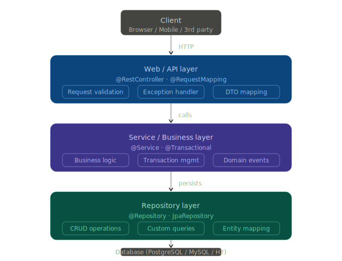

# Enterprise Application - LES 1

# Planning
* Intro
* Technologie
* Installatie Java, GIT & Maven
* Eerste Spring Boot applicatie
* Basis architectuur van een enterprise applicatie / Spring Boot applicatie
* Voorbereiding LES 2

## Intro

* Java (PROG11PRG-FUND + PRG11PRG-ADV)
* Database (SNB11DB-FUND)
* Web (PRG11STAT-WEB)

Maar hoe combineren we nu alles tot 1 grote (enterprise) applicatie??

Dit gaan we de komende weken samen onderzoeken

### Business perspectief / Analyse
https://www.vaph.be
* https://www.vaph.be/documenten/handleiding-geintegreerde-registratietool-gir
* https://www.vaph.be/documenten/vaph-publieke-apis

https://www.dov.vlaanderen.be
* https://github.com/DOV-Vlaanderen/dov-services-quickstart

## Technologie

* https://datanews.knack.be/nieuws/security/cybercrime/

Wij werken niet zomaar met software - voor een enterprise applicatie kiezen we steeds software supported is.
Security is namelijk zéér belangrijk

### Java 25 (LTS)
LTS? Java Long-Term Support

* Java 25 (LTS)

* https://docs.azul.com/core/release-notes

### Spring Boot
https://spring.io/projects/spring-boot#support
* 3.5
* 4.0
* (vanaf LES 5; 21/5) 4.1

### Andere technologie
* GIT
* Maven
* Docker
* Database (via Docker)
* Postman
* AI?
* ...

## Ons 'eerste' Spring Boot project
* In IntelliJ: File > New > Project > Spring Boot
* Via https://start.spring.io

```
@RestController
@RequestMapping("/btw")
public class BtwController {

    private static final BigDecimal BTW_RATE = new BigDecimal("0.21");

    @GetMapping("/berekenen")
    public BtwResponse calculate(@RequestParam BigDecimal amount) {
        BigDecimal btw = amount.multiply(BTW_RATE).setScale(2, RoundingMode.HALF_UP);
        BigDecimal total = amount.add(btw).setScale(2, RoundingMode.HALF_UP);
        return new BtwResponse(amount, btw, total);
    }

    public record BtwResponse(BigDecimal amount, BigDecimal btw, BigDecimal total) {}
}
```

```
@SpringBootTest
@AutoConfigureMockMvc
class BtwControllerTest {

    @Autowired
    private MockMvc mockMvc;

    @Test
    void calculate_returnsCorrectBtwAndTotal() throws Exception {
        mockMvc.perform(get("/btw/berekenen").param("amount", "100"))
                .andExpect(status().isOk())
                .andExpect(jsonPath("$.amount").value(100))
                .andExpect(jsonPath("$.btw").value(21.00))
                .andExpect(jsonPath("$.total").value(121.00));
    }

    @Test
    void calculate_roundsToTwoDecimals() throws Exception {
        mockMvc.perform(get("/btw/berekenen").param("amount", "9.99"))
                .andExpect(status().isOk())
                .andExpect(jsonPath("$.btw").value(2.10))
                .andExpect(jsonPath("$.total").value(12.09));
    }

    @Test
    void calculate_withZeroAmount() throws Exception {
        mockMvc.perform(get("/btw/berekenen").param("amount", "0"))
                .andExpect(status().isOk())
                .andExpect(jsonPath("$.btw").value(0))
                .andExpect(jsonPath("$.total").value(0));
    }

    @Test
    void calculate_withMissingAmount_returnsBadRequest() throws Exception {
        mockMvc.perform(get("/btw/berekenen"))
                .andExpect(status().isBadRequest());
    }
}
```

## Git (en GitHub)
* https://github.com/DOV-Vlaanderen/dov-services-quickstart

### Git oefening
Voeg tekst toe aan `LES1-enterprice-applications-resources.md`

## Maven
Analyseer de code van `DOV-Vlaanderen/dov-services-quickstart`

* Compileer de code (`mvn clean install`)

```
    <build>
        ...
        <plugins>
            ...
            <plugin>
              <groupId>org.owasp</groupId>
              <artifactId>dependency-check-maven</artifactId>
              <version>12.2.1</version>
              <executions>
                  <execution>
                      <goals>
                          <goal>check</goal>
                      </goals>
                  </execution>
              </executions>
            </plugin>
            ...
        </plugins>
        ...
    </build>
```

# Basis architectuur



# Voorbereiding LES 2