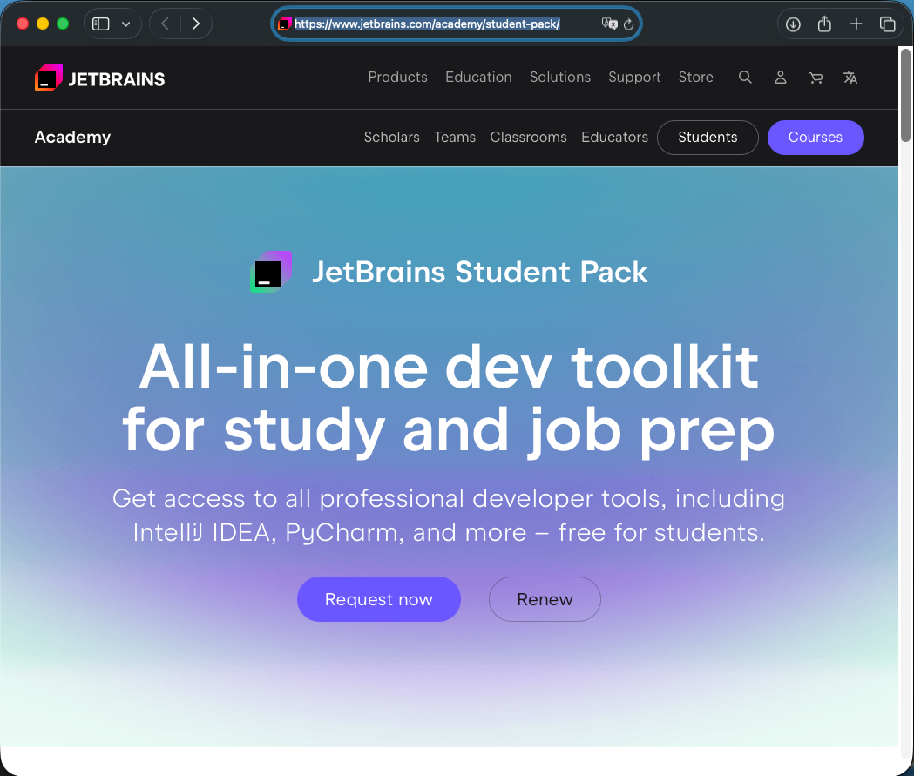
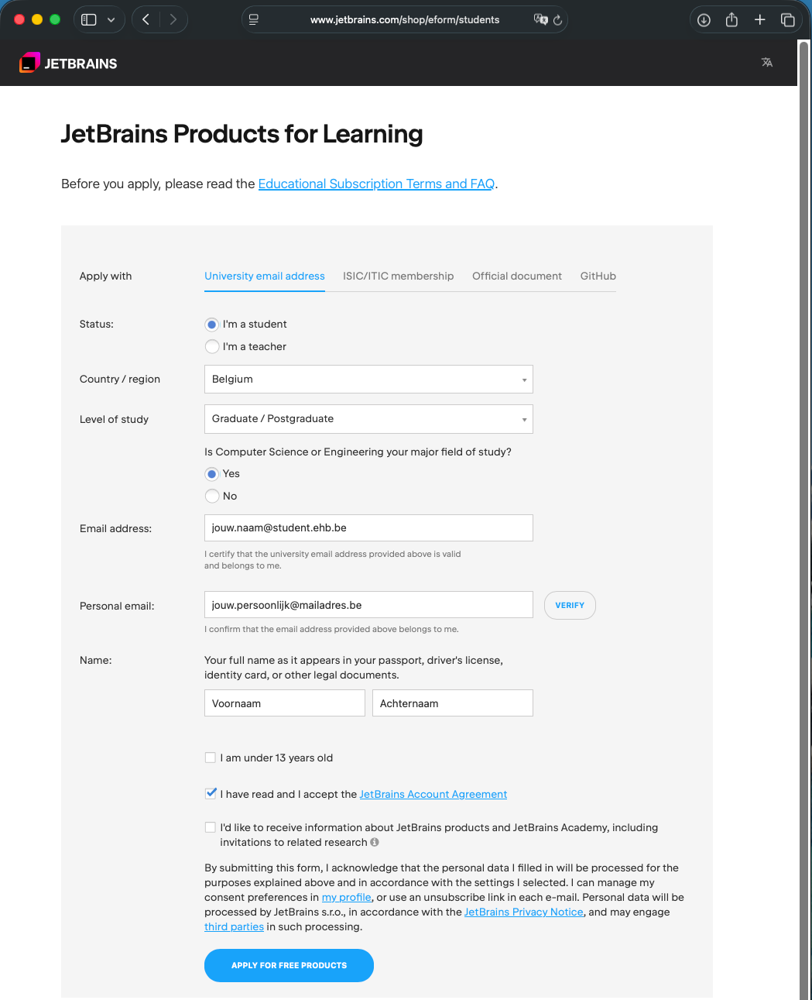
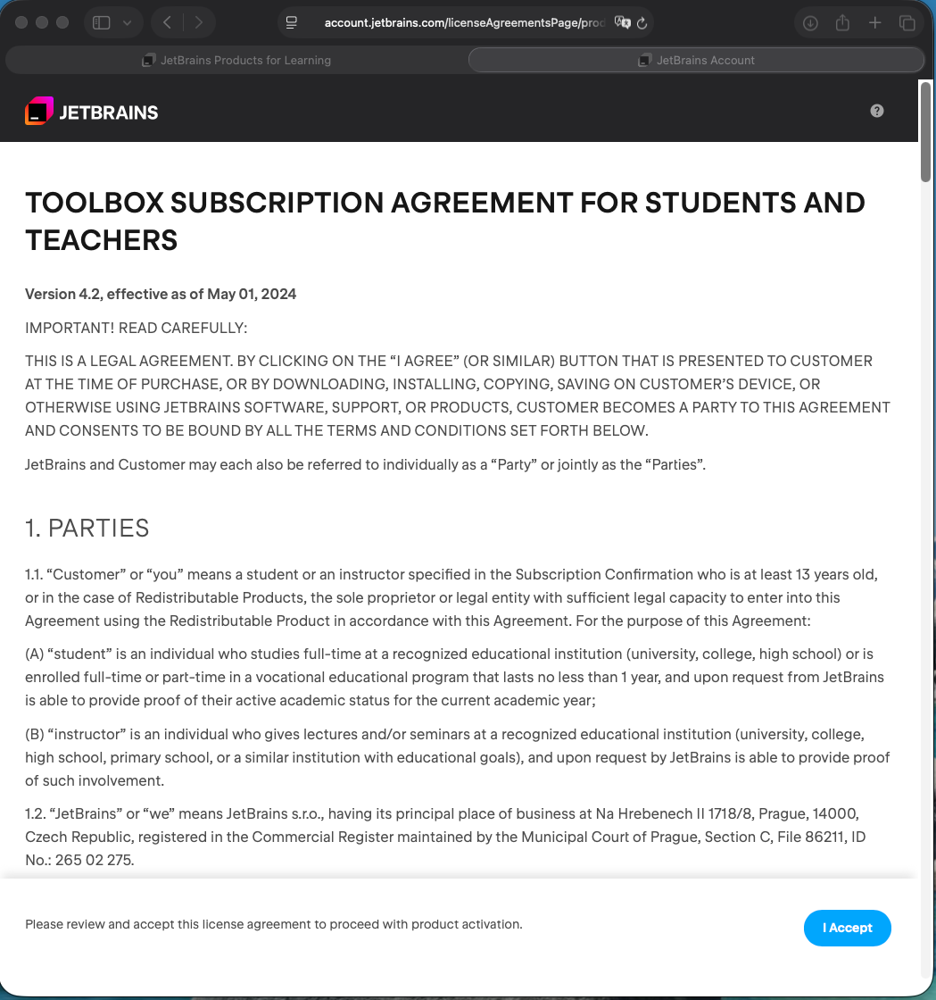
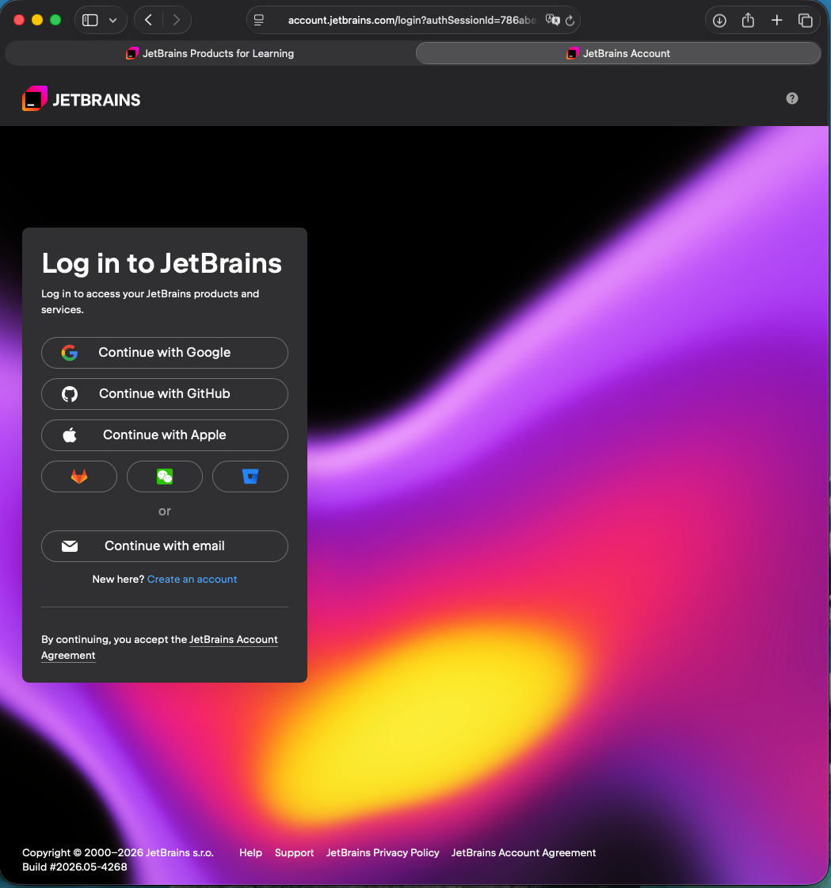
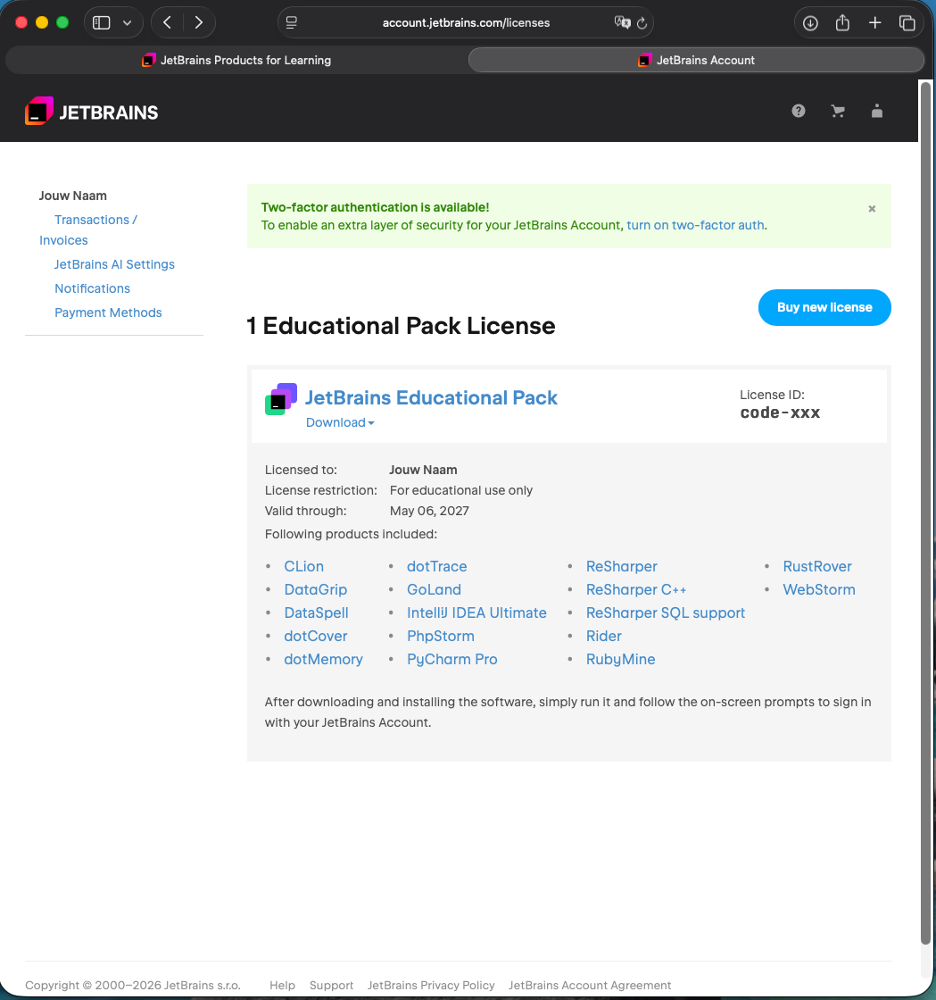
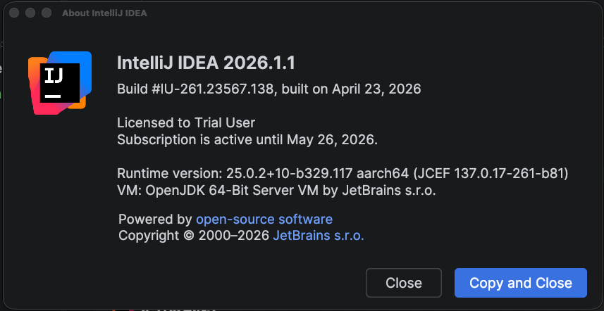
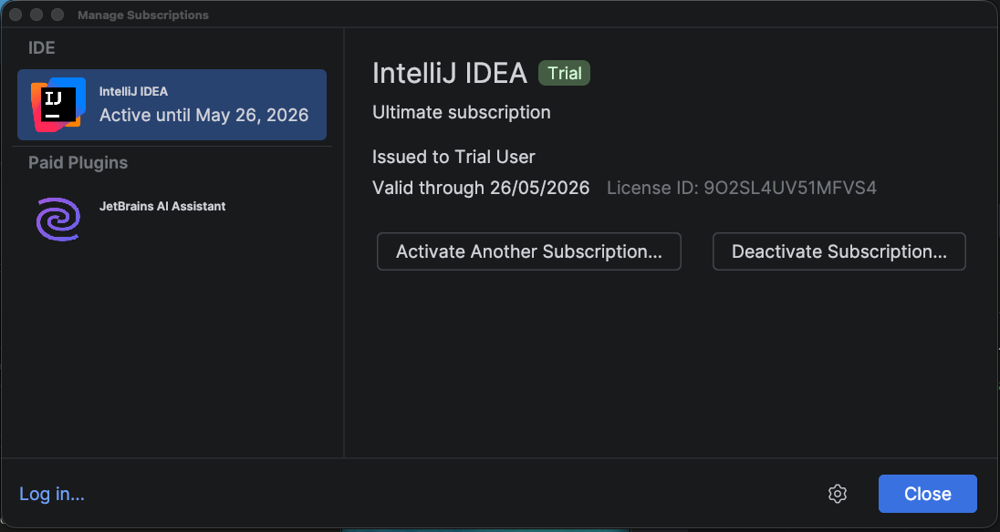
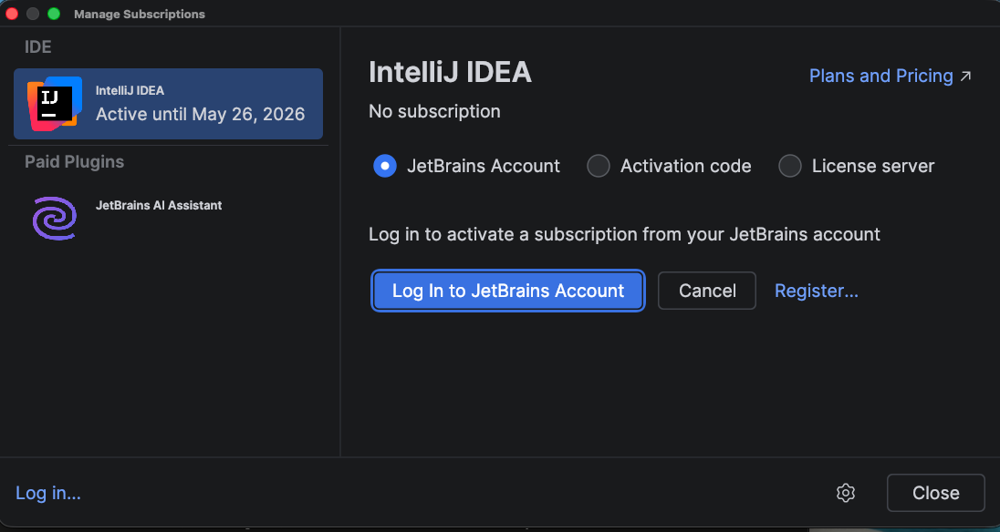
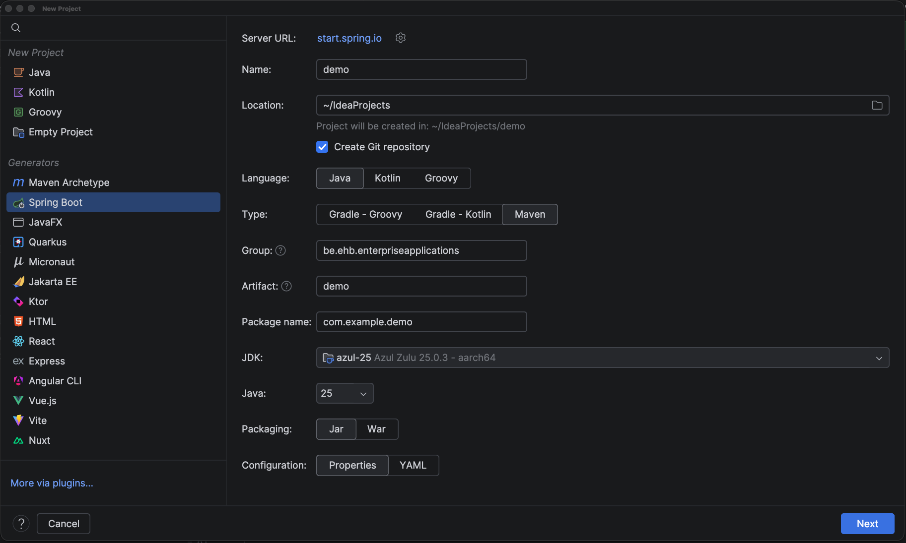

# IntelliJ opzet

> [!WARNING]
> Hou al je software steeds up2date. Verouderde software is een veiligheidsrisico.

Jullie zijn vrij om eender welke (Java) IDE te gebruiken in de lessen Enterprise Applications.
Maar als docent zal ik (meestal) gebruik maken van IntelliJ.
Voor het oplossen van problemen met andere IDEs ga ik je minder vlot kunnen ondersteunen.

1. Zorg voor de IntelliJ licentie 📄
2. Installeer de meest recente versie van IntelliJ 👩‍💻
3. Activeer de licentie
4. Problemen? 💥

## Zorg voor de IntelliJ licentie 📄
IntelliJ is geen open-source software, maar een betalend product van Jetbrains.
Als EhB student kan je wel kosteloos een studentenlicentie bemachtigen.

1. Ga naar https://www.jetbrains.com/academy/student-pack/

2. Kies 'Request now' of 'Renew' (Dit hangt af van jouw situatie)

3. Vul het formulier in + click Verify (dan krijg je een code op je persoonlijke mail)
4. Klik 'Apply for free products'
5. In je EhB-mailbox ontvang je een link om dit proces af te ronden
6. Accepteer de droge, wettelijke tekst

7. Link de IntelliJ licentie aan een JetBrains account (dat kan via Google, Github of email).
'Continue with email' was voor mij de handigste oplossing. Ik heb dit gedaan met mijn EhB-emailadres.
8. Afhankelijk van jouw situatie en de gekozen keuze (email, github, ... / bestaande account / nieuwe account) moeten je aanmelden of een nieuwe JetBrains account aanmaken.

Zodra je dit laatste scherm ziet, ben je klaar voor de volgende stap 😎

## Installeer de meest recente versie van IntelliJ 👩‍💻
> [!WARNING]
> Hou al je software steeds up2date. Verouderde software is een veiligheidsrisico.

Update jouw IntelliJ of download en installeer deze vanaf https://www.jetbrains.com/idea/download/

## Activeer de licentie
Jouw nieuwe licentie is niet noodzakelijk geactiveerd.
Zoals je in bovenstaande screenshot kan zien is er momenteel een test licentie actief (Trail)

1. In IntelliJ, klik `Help > Manage Subscriptions`

2. Kies 'Activate Another Subscription'

4. Kies 'Log in to Jetbrains Account'
5. Je gaat naar de browser en terug naar IntelliJ (mogelijks moet je aanmelden)
6. Finaal moet je in IntelliJ nog eens klikken op 'Activate'

En nu zijn we klaar voor de actie 🚀

In IntelliJ moet nu de optie 'Spring Boot' aanwezig zijn zodra je een nieuw project wilt maken via `File > New > Project`

## Problemen? 💥
1. Help elkaar
2. Indien je IntelliJ niet aan de praat krijgt, dan kan je mij (ten laatste op maandag 11/5) contacteren => samen gaan we op zoek naar een oplossing
